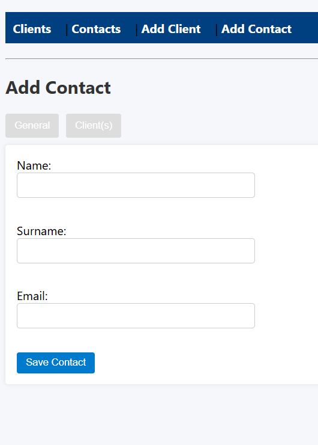

# Binary City Developer Assessment

This is a mini web application built using PHP and MySQL as part of the Binary City Software Developer Assessment (June 2025).

It allows users to manage **Clients** and **Contacts**, and to **link/unlink** them using an intuitive UI with AJAX support.

---

## 📦 Project Structure

binary-assessment/
├── add_client.php # Add or edit a client
├── add_contact.php # Add or edit a contact
├── clients.php # View and edit all clients
├── contacts.php # View and edit all contacts
├── assets/ # CSS and JavaScript
├── actions/ # AJAX handlers for linking/unlinking
├── models/ # Database and model logic
├── views/ # Reusable UI components (nav, table views)
├── sql/setup.sql # Database schema
└── README.md # You're here!

---

## 🚀 How to Run

1. ✅ **Install XAMPP** or any LAMP stack if not already installed.
2. ✅ **Create a MySQL database** called `binary_assessment`
3. ✅ **Import the database structure**:
   - Open `phpMyAdmin`
   - Select your database
   - Import the file: `sql/setup.sql`
4. ✅ **Place the project folder** (`binary-assessment`) inside your XAMPP `htdocs/` directory.
5. ✅ **Start Apache and MySQL**
6. ✅ **Open your browser** and go to:

http://localhost/binary-assessment/clients.php

---

## 🔑 Main Features

### 🧑 Clients
- Add clients with auto-generated code (`ABC001`, `DEF002`, etc.)
- Edit client details
- Link contacts to a client (via AJAX)
- Unlink contacts from a client

### 👤 Contacts
- Add new contacts with name, surname, and email
- Validate email format
- Prevent duplicate emails
- Link clients to a contact (via AJAX)
- Unlink clients from a contact

### 🔗 Many-to-Many Linking
- Real-time AJAX linking/unlinking without page refresh
- Prevents duplicate links
- Reflects relationship on both client and contact sides

---

## 🎨 Styling & UX
- Responsive table layout
- Color-coded buttons and layout
- Tabbed forms for cleaner user experience
- Friendly error and success messages

---

## 🧪 Sample Test Flow

1. Add 2–3 clients from `add_client.php`
2. Add 2–3 contacts from `add_contact.php`
3. Link each client to one or more contacts
4. Verify relationships appear in both directions
5. Try:
- Duplicate email (should be blocked)
- Invalid email format (should be rejected)
- Linking the same contact twice (should be prevented)
- Unlinking works via AJAX without page reload

---

## 🧑‍💻 Technologies Used

- ✅ PHP (No frameworks)
- ✅ MySQL (with MySQLi)
- ✅ HTML/CSS/JavaScript
- ✅ AJAX (Vanilla JS)

## 🖼️ Screenshots

### 👤 Add Contact Form

---

## 📁 Author

- **Ulamba Matheus**  
- Assessment for Binary City Developer Internship  
- June 2025  

